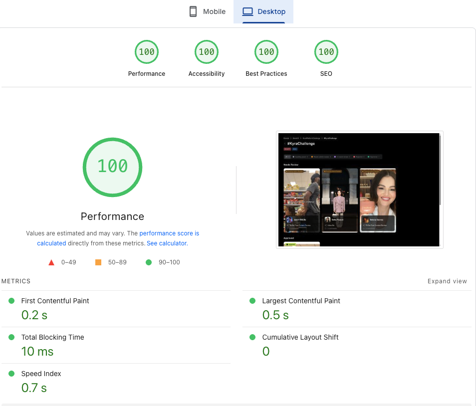
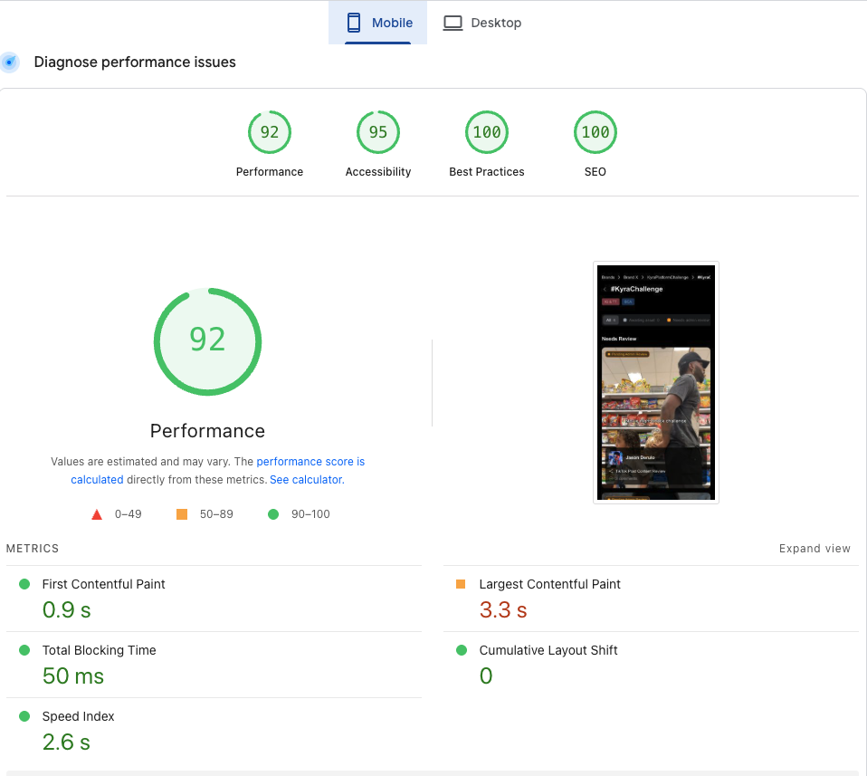

# Asset Review App

Web application for reviewing and moderating creator content.

## Installation

**Requirements:** Node.js 18+, pnpm

```bash
# Clone the repository
git clone https://github.com/goshazvir/asset-review-app.git
cd asset-review-app

# Install dependencies
pnpm install
cd api && npm install && cd ..

# Create .env.local in the root directory
echo "API_URL=http://localhost:3001" > .env.local
```

## Running the App

Start two servers in separate terminals:

```bash
# Terminal 1 — API server (port 3001)
cd api && npm run dev

# Terminal 2 — Frontend (port 3000)
pnpm dev
```

Open http://localhost:3000

## Features

- **Asset List** — main page with content cards, filter by status
- **Detail Page** — click a card to view video, brief info, and chat
- **Status Management** — "Edit Status" button to change asset status (Approved, Rejected, etc.)
- **Messages** — post comments on assets in the Messages tab
- **Responsive** — works on mobile, tablet, and desktop

## Project Structure

```
app/                 # Pages (Next.js App Router)
features/            # Business logic by feature (assets, asset-review)
components/ui/       # Reusable UI components
services/api/        # API layer (client and server)
locales/             # UI strings
config/              # Constants and configuration
api/                 # Nitro backend (mock data)
```

## Tech Stack

Next.js 15, React 19, TypeScript, Tailwind CSS 4, SWR

## Performance

| Desktop | Mobile |
|---------|--------|
|  |  |

## License

MIT
